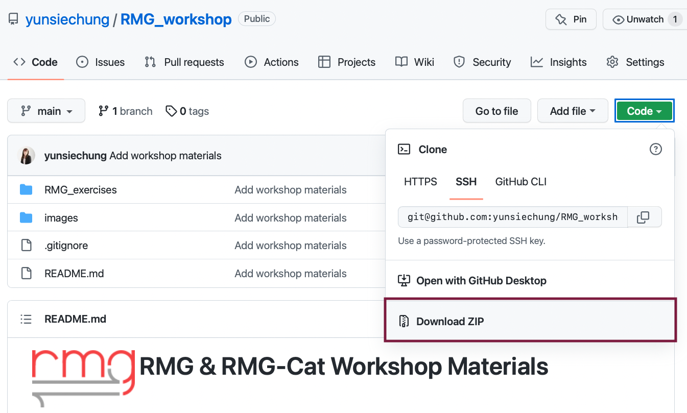

#  RMG & RMG-Cat Workshop Materials

**Reaction Mechanism Generator (RMG)** is a Python-based open-source software for automatically generating chemical reaction
mechanisms for modeling reaction systems including pyrolysis, combustion, atmospheric science, and more.

This repository contains materials and slides prepared for the RMG & RMG-Cat Workshop at 2022 Fall ACS Meeting.
The workshop slides will be uploaded on the day of the workshop on Thursday, August 25th 2022.

**Please make sure that you install RMG and download the materials BEFORE attending the workshop.**

## How to Install
RMG binary is currently supported only on Linux and Mac OSX. If you have Windows OS, please install Ubuntu
either using Virtual Machine or Linux Subsystem. To set up a Linux Virtual Machine from Windows, see this [page](http://reactionmechanismgenerator.github.io/RMG-Py/users/rmg/installation/virtualMachineSetup.html)
for detailed instruction. To set up the Linux Subsystem on Windows 10, see this [page](http://reactionmechanismgenerator.github.io/RMG-Py/users/rmg/installation/linuxSubsystem.html)
for instruction.

Once you have Linux (or Mac) set up, follow the instruction on the [Download and Install](http://reactionmechanismgenerator.github.io/RMG-Py/users/rmg/installation/anacondaUser.html) 
to install RMG binary using Anaconda. Try running the RMG test job by following Step 4 of the installation guide to make sure
RMG is installed properly.

## How to Download the Workshop Materials
Click the green button located at the top of this repository and click "Download ZIP" as shown below:

Unzip the downloaded file and remember where the files are.

## Useful Resources and References

The resources from previous workshops and relevant publications are listed [here](https://rmg.mit.edu/resources) on the RMG-website.

The ACS Fall 2022 workshop slides can be found under `slides`.

## Source Code Repository
- [RMG Github Repository](https://github.com/ReactionMechanismGenerator/RMG-Py): contains the latest source code for RMG
- [RMG-database Github Repository](https://github.com/ReactionMechanismGenerator/RMG-database): contains source code for the latest version of the database

## For Questions and Feedback

Please post any issues you may have to the [issues page](https://github.com/ReactionMechanismGenerator/RMG-Py/issues/)
or drop in to the [chat room](https://gitter.im/ReactionMechanismGenerator/RMG-Py) or email [rmg_dev@mit.edu](mailto:rmg_dev@mit.edu) if you have questions.

## License Information

RMG is a free, open-source software package (distributed under the [MIT/